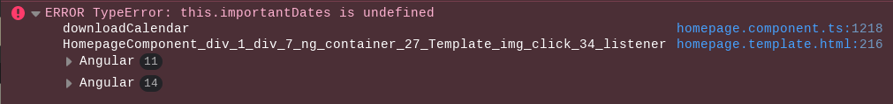

> Update 3/27/2023: ITS has fixed the issue with TigerCenter described in this post and this workaround is no longer necessary. Future issues with TigerCenter can be reported by filing a [Report an issue with TigerCenter ticket](https://help.rit.edu/sp?id=sc_cat_item&sys_id=9b613be5dbf24c50881c89584b961986) in the RIT helpdesk (help.rit.edu) system. There is also a [Request an improvement](https://help.rit.edu/sp?id=sc_cat_item&sys_id=36a3646ddbb60c50881c89584b9619f5) form. If these links do not work, try logging into help.rit.edu first, and then copy-pasting these links into the URL bar.

For the last two semesters, at least, the button that is supposed to download your schedule from RIT's [TigerCenter](https://tigercenter.rit.edu) has not been working.

## What is TigerCenter
TigerCenter is a web-based tool developed by the now-dissolved [Student IT Office](https://web.archive.org/web/20220907234336/https://www.rit.edu/its/sito/) (SITO). As far as I can tell, the goal of TigerCenter appears to be to provide students with a better, more modern, and faster interface for interacting with data from SIS. For context, this is what the SIS UI looked like until Spring 2020:

I personally use TigerCenter for its superior class search because it helps me find out what general classes I want to take (i.e. CSCI-XXX) so I can then plug those course ID's into [schedulemaker](https://schedule.csh.rit.edu/) to find the sections (i.e. CSCI-XXX-YY) that form a schedule that I like. When I was a first year (2019-ish), people were still able to remember a time when they were able to register for classes directly through SIS. 

## The Problem

As the SITO no longer seems to exist, TigerCenter's functionality has been slowly dwindling down. As of around 2019-2020 ish, TigerCenter was no longer allowed to be used for enrollment and has been slowly losing features ever since as the app goes unmaintained.

I can't really do much about that. Especially since the TigerCenter code does not appear to have been made open source like [student government](https://github.com/ritstudentgovernment/) does with their projects (props to them).

## The Solvable Problem

At the start of the Fall 2022 Semester, it seemed like [students were mad that the TigerCenter calendar feature wasnt showing any events](https://pawprints.rit.edu/?p=3525), even on weeks where classes were definitely happening. The suspicion is that this was due to a combination of SIS upgrades by either Oracle or RIT and the lack of a team to maintain TigerCenter.

The only other ways to export a calendar to a standard format (like .ics) for students to import into other calendaring tools (iCloud, Google, Thunderbird .etc) were:

- Use SIS. It had a calendar view but no obvious export button
- Export your calendar from ScheduleMaker - This was (and [still is](https://github.com/ComputerScienceHouse/schedulemaker/issues/310)) not exporting events to the correct day
- Manually enter each event and use [https://rit.edu/calendar](https://rit.edu/calendar) to account for holidays and other days off

Mycourses didn't seem to have a working class schedule feed anymore (or it isnt reliably entered by course instructors), so that was never an option.

As a tech school having non-functioning tech, for something as important as knowing when you have to be in class is kind of ridiculous, especially when its been a problem for a few semesters running.

## The Workaround

Good news: Since last semester, TigerCenter's calendar now correctly shows your class schedule.

Bad news: The download button does nothing. Opening inspect element reveals a "TypeError: this.importantDates is undefined" error when you click the button:

Here's the workaround I found to temporarily fix the issue (performed in Firefox, things may look slightly different in other browsers):

1. Click the download button to download your calender. Notice that nothing happens.

2. Open inspect element (usually in the right click menu or `Ctrl-Shift-I`). In the console tab there will probably be an errorJump to the code where the error is present by clicking on the blue text that says "homepage.component.ts:1218" next to the top line of the error

3. This will take you to the line of code that had the error. Click on the line number in this code window to mark this line as a "breakpoint"

4. Try clicking on the download calendar button again you should now see a popup saying "paused on breakpoint". You have stopped the page from running just before the error.

5. Go to the "console" tab. Type `this.importantDates` into the console and press enter. It will probably say `undefined`. This shouldn't be happening. To temporarily fix it until the page is reloaded, type `this.importantDates = []` and press enter. It should look like this:

6. Click the "play" button in the breakpoint popup from step 3. The page will now continue running and should activate your browsers configured downloader and download your calendar file.

These steps will need to be repeated if you refresh the page.

