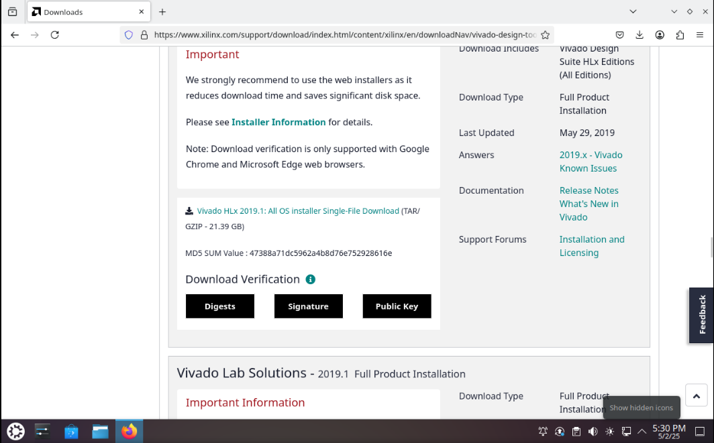
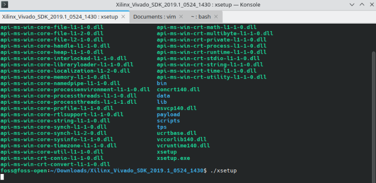
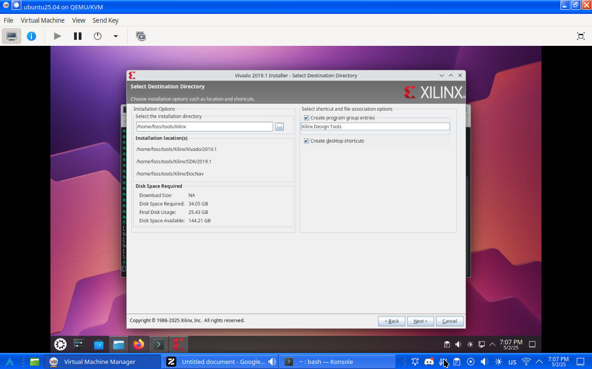
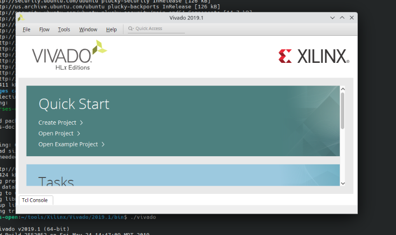

Vivado is a software that is used during digital system design II. It is installed on lab 
computers but its useful to have it on your laptop or personal computer to work on your lab on the go since they are very time consuming.
I had trouble setting up the software but no fear! Here is a guide to get it working on a clean installation of Kubuntu.

## Download Vivado

The version used in class is **2019.1**. If you haven’t downloaded it yet, you can find it here:

[Vivado 2019.1 Download Link](https://www.xilinx.com/support/download/index.html/content/xilinx/en/downloadNav/vivado-design-tools/archive.html)



## Create Directories

You’ll need two directories for the installation. Run the following commands in your terminal to create them:

```bash
mkdir -p /tools/Xilinx
```

Then, set the proper permissions:

```bash
sudo chmod -R 777 /tools/
cd tools/
sudo chmod -R 777 /Xilinx
```

## Extract the Installer

Navigate to the folder where the Vivado installer `.tar.gz` file was downloaded. Then, extract it using your preferred archive manager. For example, using `ark`:

```bash
ark -b Xilinx_Vivado_SDK_2019.1_0524_1430.tar.gz
```

## Install Dependencies

CD into the extracted folder, then into the `scripts` directory:

```bash
cd Xilinx_Vivado_SDK_2019.1_0524_1430
cd scripts
```

Run the `setupLibNCurses.sh` script:

```bash
sudo ./setupLibNCurses.sh
```

If the script fails, manually install the required dependencies:

```bash
sudo apt update
sudo apt install libtinfo-dev
sudo ln -s /lib/x86_64-linux-gnu/libtinfo.so.6 /lib/x86_64-linux-gnu/libtinfo.so.5
```

## Run the Installer

Go back to the base installation folder:

```bash
cd ..
chmod +x xsetup
./xsetup
```



> Do **not** use `sudo` for this step.  
> When prompted, select the installation folder as `/tools/Xilinx`.



After following these steps you should have vivado working on your linux machine!


---

