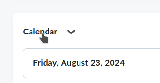
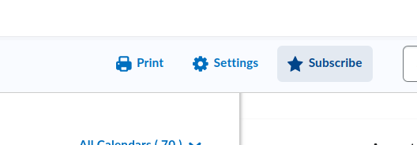
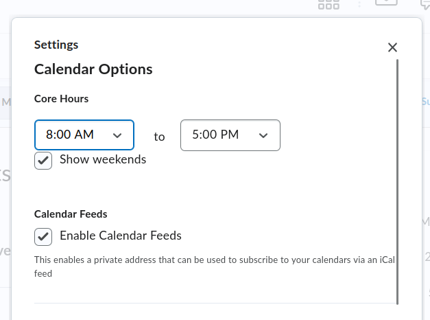
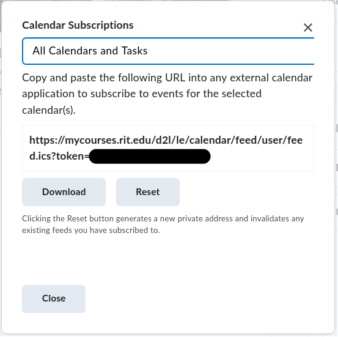

## Overview

*Disclosure: This wiki article was created in large part by ChatGPT. The final article content has been edited by a human and reviewed for accuracy*

MyCourses, RIT’s version of the D2L Brightspace Learning Management System (LMS), allows students to manage their coursework, assignments, and class schedules. One useful feature is the ability to subscribe to an ICS calendar feed, which syncs your class assignments with your preferred calendar application (e.g., Google Calendar, Outlook). This guide will walk you through the steps to subscribe to your class assignments calendar in MyCourses.

## Steps to Subscribe

### 1. Log in to MyCourses:
   - Open your web browser and navigate to RIT’s MyCourses portal.
   - Enter your RIT username and password to log in.

### 2. Access the Calendar Tool:
   - Once logged in, look for the **Calendar** widget on your MyCourses homepage. This may also be accessible from the navigation bar, usually labeled as **Calendar**.
   - Click on the **Calendar** link to open the calendar interface.

### 3. Ensure the feed is enabled:
   - In the calendar view, find the **Settings** or **Options** menu. This may appear as a gear icon or be located under a dropdown menu labeled **Settings** or **Manage Subscriptions**.

   - Ensure that calendar feeds are enabled. This may appear under a heading labeled **Calendar Feeds**

### 4. Locate the ICS Feed:
   - Look for an option that says **Subscribe** or **Export** calendar. You may need to back out of the settings screen in order to find it. You should see an option to get the ICS calendar feed URL.

### 5. Copy the ICS Feed URL:
   - A URL will be displayed, usually starting with `webcal://` or `https://`. THis is also where you can customize which classes you subscribe to.
   - Copy this URL to your clipboard.

### 6. Add the Calendar to Your Preferred Application:
   - **Google Calendar:**
     1. Open Google Calendar in your web browser.
     2. In the left-hand panel, find **Other calendars** and click the **+** icon next to it.
     3. Select **From URL** in the dropdown menu.
     4. Paste the ICS URL you copied from MyCourses.
     5. Click **Add calendar** to subscribe.
   
   - **Outlook (Web):**
     1. Open Outlook in your web browser.
     2. Go to the **Calendar** section.
     3. Click **Add calendar** in the toolbar.
     4. Select **Subscribe from web**.
     5. Paste the ICS URL and give the calendar a name.
     6. Click **Import** to subscribe.
   
   - **Apple Calendar:**
     1. Open the Calendar app on your Mac.
     2. Go to **File** > **New Calendar Subscription**.
     3. Paste the ICS URL into the **Calendar URL** field.
     4. Click **Subscribe** and customize the settings as needed.
     5. Click **OK** to add the calendar.

### 7. Sync and View Your Assignments:
   - The calendar will now sync with your application. You will be able to see your class assignments and events from MyCourses directly in your personal calendar.

## Tips
- **Auto-Refresh:** Some calendar applications automatically refresh ICS feeds periodically, but you can often adjust this in the calendar settings to ensure your assignments are always up-to-date.
- **Multiple Courses:** If you’re enrolled in multiple courses, all the assignments should appear in the same ICS feed. If not, ensure you’ve selected the appropriate calendar in MyCourses.

## Troubleshooting
- **Missing Events:** If certain assignments or events are missing, try re-subscribing to the feed or checking the calendar settings in MyCourses to ensure all relevant courses are included.
- **Sync Issues:** If your calendar application is not syncing properly, consider manually refreshing the calendar or adjusting the sync frequency in your app's settings.

This method ensures that you stay on top of your assignments by integrating them seamlessly into your daily schedule.